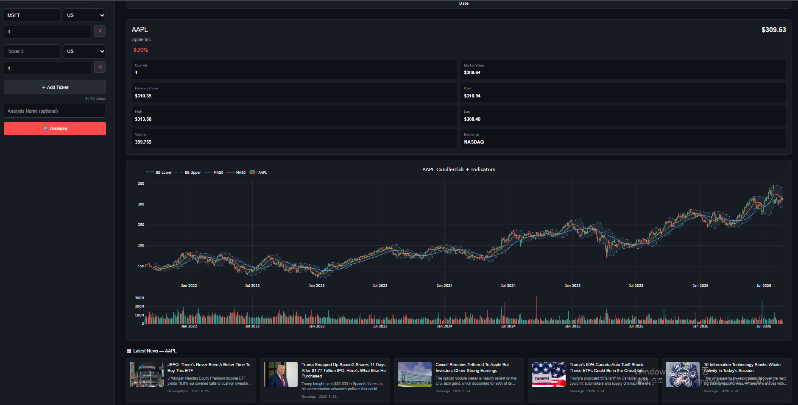

# Stock Analyzer



A web-based stock analysis tool for analyzing and comparing U.S. stocks, viewing price history, technical indicators, recent news, and saving analysis sessions.

Originally built with Python and Streamlit, the project was later rebuilt with Next.js for deployment on Vercel.

## Features

- Analyze up to 10 U.S. stocks at once
- U.S. stock market support
- Multiple analysis periods
- Portfolio summary
- Combined stock price chart
- Candlestick charts
- Moving averages (MA20 / MA50)
- Bollinger Bands
- Trading volume
- Recent company news
- User accounts
- Saved analysis history
- Reload previous analyses
- PDF report export
- API response caching

## Tech Stack

- Next.js
- React
- TypeScript
- CSS
- Plotly.js
- Neon PostgreSQL
- Twelve Data API
- Finnhub API
- Vercel

## APIs

### Twelve Data

Used for stock quotes and historical market data.

### Finnhub

Used for recent company news.

## Caching

Stock history and news requests are cached to reduce unnecessary API calls and help avoid API rate limits.

- Historical stock data: 20 minutes
- News: 15 minutes

## Running Locally

Clone the repository:

```bash
git clone https://github.com/d08835149-prog/Stock-Analyzer.git
cd Stock-Analyzer
```

Install dependencies:

```bash
npm install
```

Create a `.env.local` file in the project root:

```env
TWELVEDATA_API_KEY=your_twelve_data_api_key
FINNHUB_API_KEY=your_finnhub_api_key
NEON_DATABASE_URL=your_neon_database_url
AUTH_SECRET=your_auth_secret
```

Then start the development server:

```bash
npm run dev
```

Open:

```text
http://localhost:3000
```

## Build

To create a production build:

```bash
npm run build
```

## Deployment

The application is deployed with Vercel.

Environment variables must be configured in the Vercel project settings before deployment.

## Project History

The first version of Stock Analyzer was built with Python and Streamlit.

It worked, but the hosting setup introduced cold starts and made the application slower to open after periods of inactivity.

The project was later migrated to Next.js and Vercel. During the migration, the frontend and API structure were rebuilt while keeping the main stock analysis features.

## Disclaimer

Stock Analyzer is intended for educational and informational purposes only.

The information displayed by this application should not be considered financial or investment advice.

## P.S.

The current version focuses on U.S. stocks because some international market data requires additional API plans.

## License

MIT